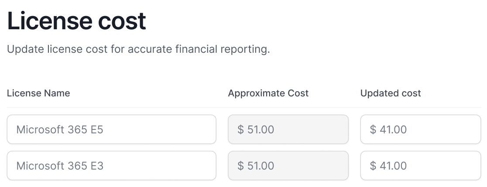

# Updating License Cost

365TUNE offers a powerful feature for generating **financial reports** related to Microsoft 365 license usage, which is one of its core functionalities. For these reports to be accurate and reflective of your organization’s actual costs, it’s crucial that **license costs** are provided by the user. By default, the platform uses publicly available **list prices** to calculate the cost of licenses in the reports.

However, the platform provides flexibility by allowing users to **update these costs** with their actual or negotiated license prices. This can be done either during the **onboarding process** or later through the **Settings** section under **`Onboarding > License Cost`**.

<figure><figcaption>
Enter the actual costs of each license in 'Update cost' fields
</figcaption></figure>

To make the process seamless, 365TUNE offers an **intuitive user interface** that simplifies the entry of license cost details. The UI allows administrators to easily enter or modify the license cost data for each detected license. This ensures that your financial reports are based on up-to-date and accurate cost information, which is key to understanding your organization’s license expenditures and optimizing costs.

The license cost data entered by users in 365TUNE is stored securely and used exclusively for the purpose of generating accurate financial reports. 365TUNE takes data security seriously, ensuring that all information entered is kept safe and confidential. The platform does not share this data with any third parties or unauthorized entities.

365TUNE is committed to maintaining user privacy and transparency. The license cost details are only used within the application to generate reports and provide insights into licensing expenses. This means that your organization’s financial data is protected and used solely to enhance your reporting experience, without any risk of external disclosure.
